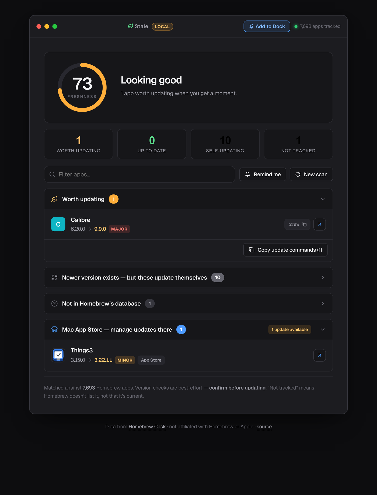

<div align="center">


# Stale

### Find the outdated apps on your Mac — privately, with no install.

The free, client-side replacement for **MacUpdater** (which shut down Jan 1, 2026).
Stale checks your installed apps against Homebrew's live version database and shows what's
out of date — **everything runs on your machine; your app list is never uploaded.**

<br>

[](LICENSE)
[](#)
[](native/)
[](#run-it)
[](#architecture)
[](#privacy)

### [▶ Try the live demo](https://rajparmar2003.github.io/stale/?demo) &nbsp;·&nbsp; no install, runs in your browser

**[Why it exists](#why-this-exists) · [Features](#features) · [How it works](#how-it-works) · [Run it](#run-it) · [Architecture](#architecture)**

<br>



<sub>Three entities, one engine: a **Web** app, a double-clickable **Local** launcher, and a native **Mac app** that scans directly and updates apps with one click.</sub>

</div>

---

## Why this exists

In January 2026, **MacUpdater** — the go-to utility for keeping non-App-Store Mac apps current — was discontinued, and *"no single app currently replicates everything MacUpdater did"* ([TidBITS](https://tidbits.com/2026/01/09/macupdater-shuts-down-leaving-users-searching-for-alternatives/), [TheSweetBits](https://thesweetbits.com/macupdater-discontinued-what-happens-now-and-what-are-the-alternatives/)). Every alternative (Latest, MacUpdate Desktop, App Cleaner) is a **native install**. There was no **browser-based, zero-install, privacy-first** option.

Stale fills that gap. It works because two things are now true:

1. **Homebrew publishes an official, public JSON API** ([formulae.brew.sh/docs/api](https://formulae.brew.sh/docs/api/)) listing ~7,600 macOS apps with their current versions — fetchable directly from a browser (CORS-open).
2. **macOS Safari 17+ lets any web page be added to the Dock** ([Apple Support](https://support.apple.com/en-us/104996)) — so a web app can live alongside native apps.

## How it works

```
your Mac                         your browser (nothing leaves it)
┌───────────────────┐            ┌───────────────────────────────────────┐
│ system_profiler   │  paste →   │ parse → dedupe → match against         │
│ SPApplications…   │            │ Homebrew Cask DB → compare versions →  │
│  -json | pbcopy   │            │ group + score + render                 │
└───────────────────┘            └───────────────────────────────────────┘
```

1. **Step 1 — copy your app list.** Run one command (Stale copies it to your clipboard for you):
   ```sh
   system_profiler SPApplicationsDataType -json | pbcopy
   ```
2. **Step 2 — paste it in** (or drop the `.json` file) and hit **Check**.
3. Stale matches each app to a Homebrew cask, compares versions, and shows you a grouped report plus a **Freshness score**.

No account. No upload. No server — there is literally nowhere for your data to go.

## Features

- **🍂 Freshness score** — one animated number (0–100) summarising how up-to-date your apps are.
- **Smart grouping** — separates *Worth updating* (apps that **don't** self-update — MacUpdater's real value) from *Self-updating* (Chrome, VS Code, etc. that fix themselves), plus *Up to date*, *Not tracked*, and *App Store*.
- **Severity badges** — `major` / `minor` / `patch` so you know how far behind you are.
- **Batch actions** — copy a ready-to-run `brew install --cask …` command for everything that needs updating.
- **Diff since last scan** — "↑ 3 updated, ＋2 new" so coming back is rewarding.
- **Resume** — your last scan is remembered locally; reopen and pick up where you left off.
- **Reminders** — download a calendar (`.ics`) nudge to re-check in two weeks.
- **Installable to the Dock** — it's a PWA; add it to your Dock and it works offline.
- **Light & dark**, keyboard- and screen-reader-friendly, respects `prefers-reduced-motion`.

## Privacy

Stale is a static site. There is no backend, no analytics, no telemetry, no cookies set by us. The only network request is a `GET` to Homebrew's public API for the version database. Your pasted app list is processed in memory and cached **only on your device** (IndexedDB) so you can resume. Read [`assets/js/app.js`](assets/js/app.js) — it's all there.

## Run it

Stale runs as **two separate but equivalent entities** — same engine, same speed, independent
storage. See [`docs/ENTITIES.md`](docs/ENTITIES.md) for the full picture.

### Local entity (on your Mac)

Double-click **`run.command`** in the `stale/` folder. It starts a tiny local server and opens
Stale in your browser. It labels itself **LOCAL** (amber badge) and keeps its own history.

> First launch: macOS may warn it's from an unidentified developer — right-click `run.command` →
> **Open** → **Open** once to trust your own file.

### Web entity (deployed)

Host the `stale/` folder on any static host (GitHub Pages, Netlify, Cloudflare Pages, …). On a
real domain it automatically identifies as the **WEB** entity (blue badge) with its own storage.

### Dev server

No build step. Any static file server works:

```sh
cd stale
npm run serve        # → http://localhost:4180   (python3 -m http.server)
```

Serve over `http://` or `https://` (not `file://`) to get the Dock/PWA + service worker. Append
`?build=web` to preview the web entity locally for a side-by-side comparison.

## Architecture

A deliberately **buildless** static app — instant load, easy to host anywhere, trivial to audit.

| Path | Responsibility |
|---|---|
| `index.html` | Markup + PWA wiring |
| `assets/css/styles.css` | All styling (macOS-native aesthetic, light/dark, gauge) |
| `assets/js/app.js` | DB loading, normalisation, matching, version compare, scoring, rendering, PWA — organised into 10 numbered sections; exposes `window.Stale` for tests |
| `service-worker.js` | Offline app-shell cache |
| `manifest.webmanifest` | PWA / Dock metadata |
| `docs/` | Plan, decisions, wins, limitations, testing |

## Limitations (read before trusting blindly)

Version comparison is a **best-effort heuristic** and coverage is limited to apps in Homebrew's database. See [`docs/LIMITATIONS.md`](docs/LIMITATIONS.md) for the full, evidence-backed list. Always confirm before updating, and prefer each app's own updater or your package manager.

## Roadmap

Next up: a **notarized `.dmg` + GitHub Release** so anyone can download and run the native app without building from source (the build/notarize automation is already done in [`native/notarize.sh`](native/notarize.sh)). See [`docs/ROADMAP.md`](docs/ROADMAP.md).

## Credits & licence

- Version data: the **[Homebrew Cask](https://formulae.brew.sh)** project (BSD-2-Clause). Stale is not affiliated with Homebrew.
- Not affiliated with or endorsed by Apple.
- Licensed under [MIT](LICENSE).
